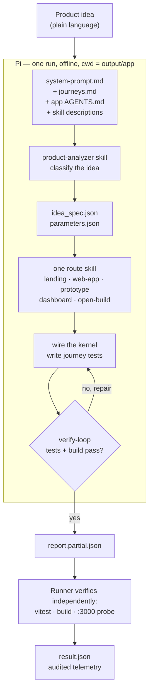

# AgentCofounder

Turns a non-technical product idea into a working, tested browser application in
one autonomous run.

The strategy is simple to state: **prebuild the software engineering so the model
only makes product decisions.** A tested kernel of primitives ships in the
repository. The agent classifies the idea, writes a configuration file, and wires
what already exists. Work that would otherwise be paid for in model output tokens
is paid for once, in committed code.

Starter documentation from the challenge organizers — setup, execution,
telemetry ownership, freeze procedure, security — is in
[docs/starter.md](docs/starter.md).

## Architecture



Five routes, one floor. The routes change what the product *looks like*; none of
them changes whether its data survives.

| Route | For an idea that asks for | Always also ships |
|---|---|---|
| `web-app` | Doing the work: tracking, managing, keeping records | The full collection screen |
| `mock-dashboard` | Numbers at a glance | A way to enter the records behind the charts |
| `landing-page` | Explaining something not yet built | A signup capture that really stores signups |
| `prototype` | Seeing and clicking a flow first | A record written on completion |
| `open-build` | Anything else, or too vague to classify | Whatever the idea needs, meeting the floor |

### The delivery floor

Every route, no exceptions:

1. At least one persisted entity, reached only through the repository boundary
2. Create, edit, delete
3. At least one filter and at least one derived value
4. Data survives a page refresh
5. At least one passing test per journey; never skipped or todo
6. Works narrow and wide
7. Limitations shown in the interface, not buried in a report
8. `API.md` describes the data boundary as built
9. Runs at `http://localhost:3000`, leaves no process behind

The floor exists because the scoring rubric — data and state persistence,
robustness, integration readiness — is written for applications that hold data. A
landing page with a form that discards what it collects is a picture of a
product, and scores like one.

## parameters.json

The contract between the agent's product decisions and the prebuilt engineering.
It is validated by [`app-template/parameters.schema.json`](app-template/parameters.schema.json),
and the kernel refuses to start on an invalid file.

```jsonc
{
  "route": "web-app",
  "product": { "name": "...", "tagline": "..." },
  "theme": { "preset": "ocean-depths" },     // 10 presets, colour only
  "navigation": [ /* menu count picks the layout */ ],
  "entities": [ /* fields, filters, derived values */ ],
  "features": { "search": true, "auth": false, "limitations": ["..."] },
  "dashboard": { "main": {}, "sub": [] },    // mock-dashboard route
  "landing":   { "sections": [], "captureEntity": "" },
  "prototype": { "screens": [] },
  "persistence": { "adapter": "localStorage", "namespace": "..." }
}
```

Navigation count decides the chrome: one entry means no navigation at all, two
to four a bar, five or more a sidebar that wraps on narrow screens. The agent
never picks a layout by hand.

## The prebuilt kernel

In `app-template/src`, shipped tested and building green with zero model edits.

| Area | What it provides |
|---|---|
| `kernel/` | Loads and validates `parameters.json`; `useRepository` binds a collection to a view |
| `data/repository.ts` | The single boundary between interface and storage |
| `data/localStorageAdapter.ts` | Browser persistence that recovers from corrupt or foreign data |
| `data/operations.ts` | Validation, filters, derived values — pure functions, no React |
| `ui/CollectionView.tsx` | Add, edit, delete with confirmation, filter, search, totals, empty states |
| `ui/Chart.tsx`, `ui/DashboardGrid.tsx` | SVG charts with accessible summaries; one headline plus four supporting plots |
| `ui/LandingPage.tsx` | Hero, comparison, FAQ, call to action, with a real capture form |
| `ui/PrototypeFlow.tsx` | Multi-screen walkthrough that carries state and stores a record |
| `auth/mockAuth.ts` | Demonstration roles behind the interface a real provider would satisfy |
| `mock/generators.ts` | Seeded sample data — identical on every run, so it can be asserted |
| `styles.css`, `themes/` | Semantic classes and ten colour presets, no CSS framework |

No Tailwind, no charting library, no backend SDK. Every dependency added is an
install cost on every run and, for a utility-class framework, an output-token
cost on every element the model writes.

### Why offline shapes everything

The runner sets `PI_OFFLINE=1` and passes `--offline`, and judging blocks
outbound network. So there is no competitor search (a committed
[positioning dataset](app-template/src/content/positioning.json) of general
alternatives instead), no CDN, no `npx`, no Supabase, and no hosted auth. The
repository boundary is the integration story: implement one more `StorageAdapter`
and nothing above it changes.

## The agentic loop

`solution/extensions/verify-loop.ts` listens for `agent_settled` — the moment the
model believes it is finished — then runs the tests and the production build. On
failure it hands the shortest decisive output back through `pi.sendMessage()` so
the agent repairs it inside the same run, bounded by three attempts and a
wall-clock budget. It never starts a development server: the runner owns port
3000.

Without it, a failure is discovered after the run is over, when it can only be
recorded.

## Scoring

`npm run score` writes `artifacts/score.json`.

- **Structural checks** run without credentials and gate CI: repository boundary
  present, no component touching storage directly, error boundary mounted,
  validation wired, `API.md` written, responsive breakpoints, limitations
  surfaced, tests querying by accessible name.
- **Efficiency** needs a completed run: total tokens, output tokens, model calls,
  cost, and tokens spent per delivered journey.

Efficiency cannot be measured on a pull request — it needs a real model call.
The full run is a manual or nightly job across the five
[route fixtures](docs/fixtures/).

## Commands

```bash
npm ci --ignore-scripts && npm --prefix app-template ci --ignore-scripts
```

```bash
npm run check
```

```bash
npm run challenge
```

```bash
npm run score
```

Run one fixture through a specific route:

```bash
npm run challenge -- --idea-file docs/fixtures/dashboard.txt
```

## Repository map

| Path | Owner | Purpose |
|---|---|---|
| `solution/system-prompt.md` | Us | What the agent is told |
| `solution/skills/` | Us | Analyzer, five routes, and one vendored design skill |
| `solution/extensions/` | Us | Write guard and the verify-repair loop |
| `app-template/` | Us | The prebuilt kernel, copied into a fresh workspace each run |
| `src/` | Organizer | Runner, verification, telemetry, scoring |
| `contract-public/` | Organizer | Public idea, journey guidance, result schema |
| `output/`, `artifacts/` | Runner | Generated. Reset every run |

`AGENTS.md` and `MEMORY.md` at the root are development context for coding
agents working on this harness. Pi never reads them — the runner passes
`--no-context-files`. Both are deleted before submission.
